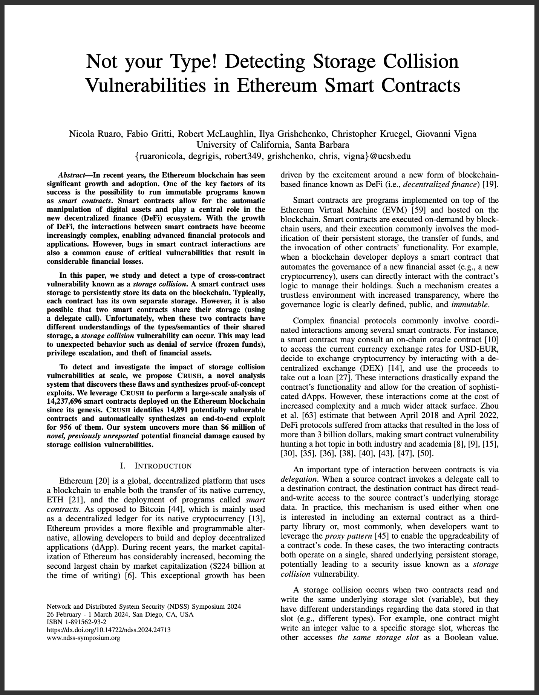

# Not your Type! Detecting Storage Collision Vulnerabilities in Ethereum Smart Contracts


[](https://www.python.org)

<a href="https://seclab.cs.ucsb.edu/files/publications/ruaro24crush.pdf">  </a>

This repository contains the code used for our NDSS 2024 paper <a href="https://seclab.cs.ucsb.edu/files/publications/ruaro24crush.pdf">Not your Type! Detecting Storage Collision Vulnerabilities in Ethereum Smart Contracts</a>.
Our system, `crush`, can be used to find exploitable storage collision vulnerabilities on the Ethereum blockchain.

### ⚠️ Disclaimer 
For ethical reasons, we are not releasing a fully automated "push-one-button" solution for the identification and automatic exploitation of vulnerable smart contracts. We instead open-source all the necessary scripts to demonstrate the approach presented in our paper. Interested researchers will have all the necessary code to replicate our work. In case something does not click, please reach out to us :)

### Dependencies
To run `crush`, you will need:
* To install [`greed`](https://github.com/ucsb-seclab/greed) -- our symbolic execution engine for EVM smart contract binaries.
* For some of the analyses, you will need access to an Ethereum (archive) node (e.g., [go-ethereum](https://geth.ethereum.org), [erigon](https://github.com/ledgerwatch/erigon)).
* For some of the analyses, you will need a database of historical (internal) transactions. We maintain our own (private) database, but you can also use other existing serivces (e.g., [ether-sql](https://github.com/analyseether/ether_sql)).

### Usage
```bash
# you can run the individual analyses in crush with:
# ./crush.py interactions <ADDRESS>    # needs postgres
# ./crush.py lifespan <ADDRESS>        # needs postgres, web3
# ./crush.py type <ADDRESS>
# ./crush.py collision <ADDRESS>
# ./crush.py impact <ADDRESS>
# ./crush.py exploit <ATTACK REQUEST>  # needs web3

# some analyses however depend on the results of others, so we provide a script to run all analyses at once:
./crush.sh --proxy 0x4DEcA517D6817B6510798b7328F2314d3003AbAC --data-path ./data.example
```
